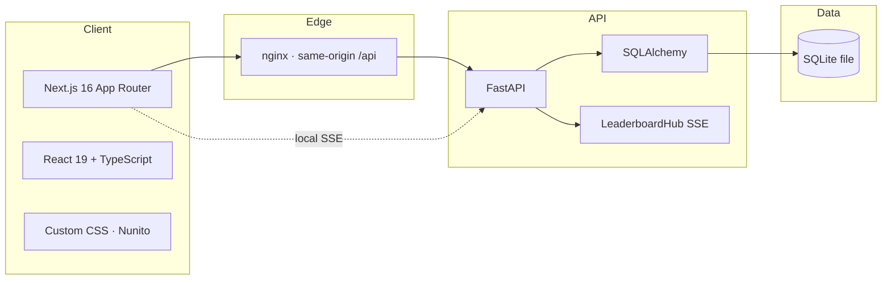
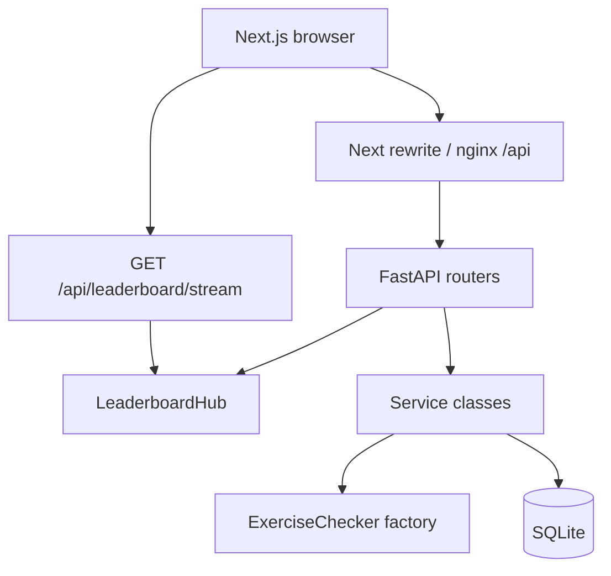
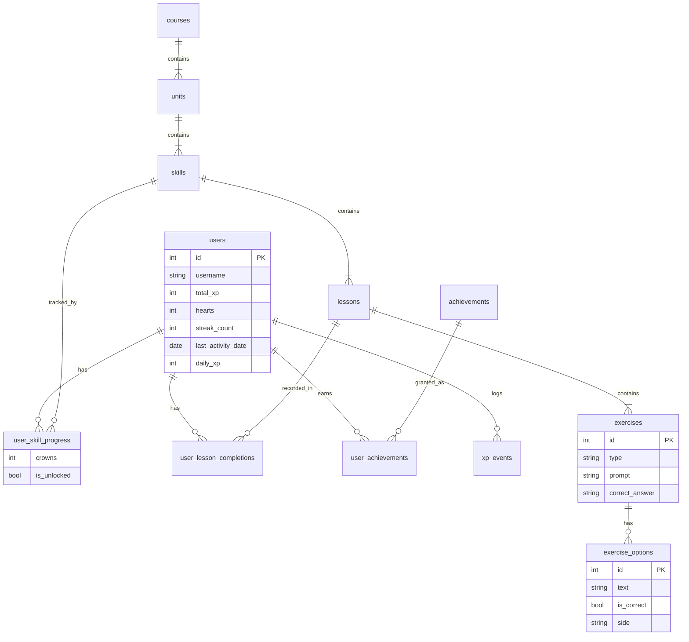
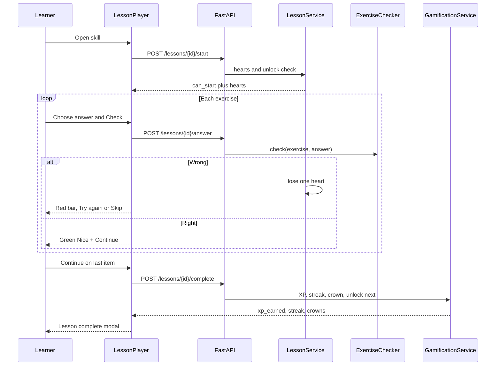
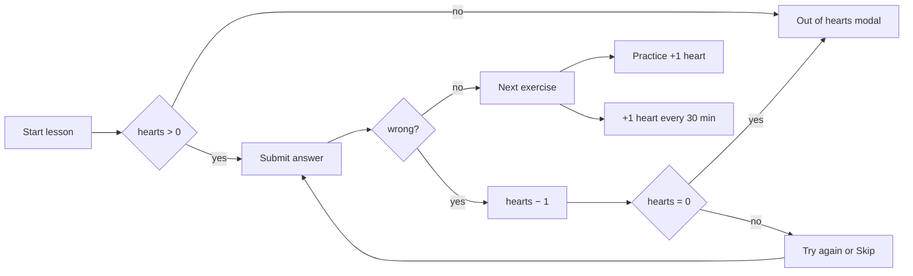
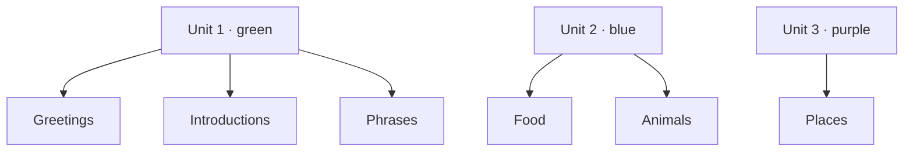

<div align="center">

# Fluent

**A Duolingo-style Spanish learning app** — skill path, mixed lessons, hearts, XP, streaks, and a live league.

[Open locally](#quick-start) · [Docker](#run-with-docker) · [API](#api-reference) · [Architecture](#architecture)

<br />


</div>

---

<p align="center">
  <b>Always signed in as Alex</b> &nbsp;·&nbsp;
  Spanish from English &nbsp;·&nbsp;
  Server-side grading &nbsp;·&nbsp;
  Live leaderboard (SSE)
</p>

```
┌──────────────┐   ┌────────────────────────────┐   ┌──────────────┐
│   LEARN      │   │     JUMP BACK IN           │   │  STREAK  🔥  │
│   PRACTICE   │   │  Greetings · Start +10 XP  │   │  GEMS    💎  │
│   LEAGUE     │   │                            │   │  HEARTS  ❤  │
│   PROFILE    │   │      🦉  current skill     │   │──────────────│
│   SETTINGS   │   │         (Greetings)        │   │ Daily quest  │
│              │   │            ●               │   │ Leaderboard  │
│    fluent    │   │          Intro               │   │ Super Fluent │
└──────────────┘   └────────────────────────────┘   └──────────────┘
   Sidebar               Learning path                  Right rail
```

---

## Table of contents

- [Why Fluent](#why-fluent)
- [Features](#features)
- [Tech stack](#tech-stack)
- [Demo learner](#demo-learner)
- [Screens](#screens)
- [Quick start](#quick-start)
- [Run with Docker](#run-with-docker)
- [Environment](#environment)
- [Architecture](#architecture)
- [Database](#database)
- [Lesson loop](#lesson-loop)
- [Exercise types](#exercise-types)
- [Game rules](#game-rules)
- [Course content](#course-content)
- [API reference](#api-reference)
- [Design system](#design-system)
- [Repository layout](#repository-layout)
- [Keyboard shortcuts](#keyboard-shortcuts)
- [Live leaderboard](#live-leaderboard)
- [Deploy](#deploy)
- [Assumptions](#assumptions)

---

## Why Fluent

Fluent is a full-stack language product, not a static page of questions. The learning path, hearts, XP, crowns, and league are stored in SQLite and graded on the server. The UI is built to feel like Duolingo: a green owl mascot, 3D buttons, a winding skill path, and a fullscreen lesson player with instant feedback.

| The learner sees | The server owns |
| --- | --- |
| Path, owl, animations, Check / Try again | Unlock rules, hearts, XP, streaks |
| Shuffled choices and word banks | Whether the answer is correct |
| Live league rank | Ranking by `total_xp` over SSE |

---

## Features

| Area | What you get |
| --- | --- |
| **Learning path** | Three units, six skills, lock / ready / crowned states, gold crown rings, Jump back in, Guidebook |
| **Lessons** | Five exercise types, speaker (TTS), progress bar, sounds, owl reactions |
| **Hearts** | 5 max, −1 on a wrong Check, out-of-hearts modal, 30-minute regen, Practice +1, Settings refill |
| **XP & streaks** | 10 XP per lesson, +5 if perfect, 20 XP legendary, daily goal 20 XP, simulate-next-day |
| **League** | Real users ranked by XP, **server-sent events** (no polling) |
| **Profile** | Total XP, streak, lessons, unlocked skills, achievement badges |
| **Practice** | Review MCQs that restore a heart without losing more |
| **Legendary** | 60-second timed run on a crowned skill |
| **UI** | Nunito, Duolingo palette, dark mode, responsive sidebar / mobile nav |
| **Mascot** | Owl bobs and hops on the current skill; happy / sad / celebrate in lessons |

---

## Tech stack



| Layer | Choice | Role |
| --- | --- | --- |
| Frontend | Next.js 16, React 19, TypeScript | App Router pages, lesson player, path |
| Styling | Custom CSS (no Tailwind) | Duolingo-like layout and motion |
| Backend | FastAPI + Pydantic | REST + SSE |
| ORM | SQLAlchemy 2 | Models, sessions, WAL SQLite |
| Database | SQLite | Course + progress in one file |
| Proxy | nginx (Compose) | `/` → frontend, `/api` → backend, SSE unbuffered |
| Containers | Docker Compose | `fluent-backend`, `fluent-frontend`, `proxy` |

---

## Demo learner

You never sign up. `get_current_user` always loads **Alex** (`user_id = 1`).

| | Alex starts with |
| --- | --- |
| Path | **Greetings** already crowned; Introductions is next |
| XP | 120 total · 10 daily / 20 goal |
| Streak | 3 days |
| Hearts | 5 / 5 |
| Gems | 450 (display only) |
| League | Bella, Carlos, Dana, and Eli are seeded so the board is not empty |

Reset demo data by stopping the API and deleting the SQLite file (see [Quick start](#quick-start)). Seed runs again only when user `alex` is missing.

---

## Screens

| Route | Screen | Notes |
| --- | --- | --- |
| `/` | Learn | Skill path, Jump back in, Guidebook |
| `/practice` | Practice | Heart refill, no hearts lost on wrong answers |
| `/leaderboard` | League | Live SSE ranking |
| `/profile` | Profile | Stats + badges |
| `/settings` | Settings | Dark mode, simulate day, refill hearts |
| `/lesson/{id}` | Lesson | Fullscreen player |
| `/legendary/{skillId}` | Legendary | 60s timed challenge |

```
  LESSON PLAYER
 ────────────────────────────────────────────────
  ×   ████████░░░░░░░░░░░░░░░░   ❤ 5
 ────────────────────────────────────────────────
        🦉
        🔊  What does "Hola" mean?

        A  Thanks          ← wrong pick shakes red
        B  Please
        C  Hello           ← correct hint after a miss
        D  Water
 ────────────────────────────────────────────────
  Not quite · The answer is Hello     [Try again] [Skip]
 ────────────────────────────────────────────────
```

After a wrong Check you can pick another choice and Check again. Hearts already lost stay lost. **Skip** moves on. **Continue** appears only after a correct answer.

---

## Quick start

Use **two terminals**. Python 3.11+ and Node 20+ are enough.

SQLite is created on first boot. The API prefers `backend/data/fluent.db`, then falls back to `backend/data/lingo.db` or `backend/lingo.db` if those already exist.

### 1. Backend

```bash
cd backend
python -m venv .venv

# Windows
.venv\Scripts\activate

# macOS / Linux
source .venv/bin/activate

pip install -r requirements.txt
copy .env.example .env          # Windows
# cp .env.example .env          # macOS / Linux
python -m uvicorn app.main:app --reload --host 127.0.0.1 --port 8000
```

| | URL |
| --- | --- |
| API | http://127.0.0.1:8000 |
| Health | http://127.0.0.1:8000/api/health |
| Swagger | http://127.0.0.1:8000/docs |
| OpenAPI | http://127.0.0.1:8000/openapi.json |

### 2. Frontend

```bash
cd frontend
copy .env.example .env.local    # Windows
# cp .env.example .env.local    # macOS / Linux
npm install
npm run dev
```

Open **http://localhost:3000**.

Local `.env.local` sets `NEXT_PUBLIC_API_URL=http://127.0.0.1:8000` so the browser talks to FastAPI directly. That keeps **leaderboard SSE** off the Next.js rewrite (rewrites can buffer the stream).

---

## Run with Docker

Docker Desktop (or Engine + Compose) from the **project root**:

```bash
docker compose up --build
```

Then open **http://localhost:3000**. nginx routes `/` to Next.js and `/api` to FastAPI.

| Service | Image | On your machine |
| --- | --- | --- |
| App | `nginx` + `fluent-frontend` | http://localhost:3000 |
| API docs | `fluent-backend` | http://localhost:8000/docs |
| SQLite | bind mount `./data` | `data/lingo.db` |

The database is **not** baked into the image. Compose mounts `./data:/data` and sets `DATABASE_PATH=/data/lingo.db`. Rebuilds keep XP, hearts, streaks, and crowns.

```bash
# code change — rebuild images, keep the DB
docker compose up --build -d

# stop (does not delete the DB)
docker compose down

# reset Alex to a fresh seed
docker compose down
# delete data/lingo.db  (and -wal / -shm if present)
docker compose up --build
```

Do **not** delete the DB when you only changed UI or lesson copy.

---

## Environment

Copy the example files. **Do not commit** `.env` or `.env.local`.

### Backend `backend/.env`

| Variable | Default | Meaning |
| --- | --- | --- |
| `DATABASE_PATH` | `./data/lingo.db` locally | SQLite file path |
| `DATABASE_URL` | built from the path | Optional full SQLAlchemy URL |
| `CORS_ORIGINS` | `http://localhost:3000,http://127.0.0.1:3000` | Browser origins allowed to call the API |

### Frontend `frontend/.env.local`

| Variable | Local default | Meaning |
| --- | --- | --- |
| `NEXT_PUBLIC_API_URL` | `http://127.0.0.1:8000` | Browser origin of FastAPI. **Empty** in Docker so `/api` is same-origin |
| `API_PROXY_TARGET` | `http://127.0.0.1:8000` | Next.js rewrite target when the public URL is empty |

---

## Architecture

Routers stay thin. Services own game rules. Checkers grade answers. Models are tables.



| Backend package | Responsibility |
| --- | --- |
| `routers/` | HTTP only |
| `services/` | User, course, lesson, gamification, achievements |
| `checkers/` | One class per exercise type |
| `events.py` | In-memory SSE hub for the league |
| `seed.py` | Spanish course + Alex + league users |
| `config.py` | Hearts, XP, default user, SQLite path |

Frontend components **render and call** `lib/api.ts`. They never decide if an answer is right.

---

## Database

Course content and learner progress are separate tables, so the Spanish tree can be reused if you add more users later.



**Unlock rule:** skill 1 starts unlocked. Completing a skill (at least 1 crown) unlocks the next skill on the path.

`create_all` **adds missing tables**. It does not migrate old columns. If you change a model field, delete the SQLite file once and let seed recreate it.

---

## Lesson loop

Every **Check** hits the API. The browser never grades locally.



### Hearts



Options are **shuffled** on every lesson fetch. Multiple-choice and fill-blank grade against `exercise_options.is_correct`. Lesson payloads never send `is_correct` to the client.

---

## Exercise types

| Type | UI | How it is graded |
| --- | --- | --- |
| `multiple_choice` | A–D buttons | Selected text must match a correct option |
| `fill_blank` | Same choice list | Same checker as MCQ |
| `translate` | Word bank → sentence | Ordered words vs expected sentence |
| `match_pairs` | Left / right cards | `left=right` pairs, any order |
| `type_answer` | Text field | Normalized string vs `correct_answer` |

Wrong MCQ/fill-blank: the missed pick turns red, the right option is hinted, choices unlock so you can Check again. Match / translate / type use **Try again** to reset the board.

---

## Game rules

| Rule | Value |
| --- | --- |
| Max hearts | 5 |
| Wrong Check | −1 heart; lesson stops at 0 |
| Heart regen | +1 every **30** minutes |
| Practice complete | +1 heart |
| Settings refill | Full hearts (demo Super) |
| Lesson XP | **10** |
| Perfect lesson (0 hearts lost) | **+5** bonus |
| Legendary | **20** XP, **60** second timer |
| Daily goal | **20** XP |
| Streak | Same calendar day: keep · yesterday: +1 · older gap: reset to 1 |

Settings → **Simulate next day** moves last activity back one day so you can demo streaks without waiting.

---

## Course content

Spanish for English speakers. Each skill has one lesson mixing all five exercise types.



| Unit | Color | Skills |
| --- | --- | --- |
| Unit 1 — Order coffee, say hello, introduce yourself | `#58CC02` | Greetings · Introductions · Phrases |
| Unit 2 — Food and animals | `#1CB0F6` | Food · Animals |
| Unit 3 — Places around town | `#CE82FF` | Places |

Sample items: *Hola* → Hello, *Me llamo* → My name is, *¿Cómo estás?* → How are you?, *el pan* → bread, *el gato* → the cat.

**Achievements:** First Lesson, Streak Starter, XP Hunter, Unit Finisher, Perfect Lesson.

---

## API reference

All routes are under `/api`. The current user is always Alex.

| Method | Path | What it does |
| --- | --- | --- |
| `GET` | `/health` | Liveness `{ "status": "ok" }` |
| `GET` | `/users/me` | Stats; also regenerates hearts |
| `POST` | `/users/me/simulate-day` | Move last activity back one day |
| `POST` | `/users/me/refill-hearts` | Mock full refill |
| `GET` | `/course/path` | Units, skills, locks, crowns, `lesson_id` |
| `GET` | `/lessons/{id}` | Prompts + shuffled options (no answers) |
| `POST` | `/lessons/{id}/start` | Unlock + hearts gate |
| `POST` | `/lessons/{id}/answer` | Grade one exercise |
| `POST` | `/lessons/{id}/complete` | XP, streak, crowns, badges |
| `GET` | `/practice` | Five review MCQs |
| `POST` | `/practice/answer` | Grade without losing hearts |
| `POST` | `/practice/complete` | +1 heart |
| `GET` | `/leaderboard` | Users ranked by `total_xp` |
| `GET` | `/leaderboard/stream` | SSE push when XP changes |
| `GET` | `/profile` | Stats + achievements |
| `POST` | `/legendary/{skill_id}/complete` | Timed bonus XP |

Interactive docs: [http://127.0.0.1:8000/docs](http://127.0.0.1:8000/docs).

---

## Design system

Inspired by Duolingo. Implemented in `frontend/app/globals.css` with CSS variables. Dark mode sets `data-theme="dark"` on `<html>` (Settings toggle, key `fluent-theme`).

| Token | Hex | Use |
| --- | --- | --- |
| Green | `#58CC02` | Brand, Start, correct, path nodes |
| Green dark | `#46A302` | Button 3D shadow |
| Blue | `#1CB0F6` | Gems, selected choice, secondary actions |
| Gold | `#FFC800` | Crowns, daily quest, Super |
| Red | `#FF4B4B` | Hearts, incorrect |
| Purple | `#CE82FF` | Legendary nodes |
| Orange | `#FF9600` | Streak fire, legendary timer |
| Text | `#3C3C3C` | Body (light) |

**Type:** [Nunito](https://fonts.google.com/specimen/Nunito) 600–900.

**Motion**

- Owl: idle bob + blink, path hop beside the current skill, happy / sad / celebrate in lessons
- Current skill node: gentle pulse
- Choices: hover lift, wrong shake, correct hint
- Feedback bar: slide up
- 3D buttons: bottom shadow, press translate

**Layout**

| Region | Width | Content |
| --- | --- | --- |
| Left sidebar | 256px | fluent mark, Learn / Practice / League / Profile / Settings |
| Main column | fluid | Path or page |
| Right rail | 320px | Streak, gems, hearts, daily quest, league, Super Fluent |
| Mobile | bottom nav | Learn, Practice, League, Profile |

Lesson player is fullscreen (no shell). Business copy such as **Super Fluent** is a placeholder — there is no shop or IAP.

---

## Repository layout

```
Scalar AI Labs/
├── README.md
├── docker-compose.yml          fluent-backend + fluent-frontend + nginx
├── nginx/default.conf          same-origin /api, SSE unbuffered
├── data/                       Docker SQLite (gitignored)
├── backend/
│   ├── Dockerfile
│   ├── requirements.txt
│   ├── .env.example
│   └── app/
│       ├── main.py             FastAPI, CORS, seed on startup
│       ├── config.py           hearts, XP, SQLite path
│       ├── database.py         engine, WAL, get_db
│       ├── events.py           leaderboard SSE hub
│       ├── seed.py             Spanish course + Alex
│       ├── models/             SQLAlchemy tables
│       ├── schemas/            Pydantic DTOs
│       ├── routers/            thin HTTP
│       ├── services/           game rules
│       └── checkers/           one class per exercise type
└── frontend/
    ├── Dockerfile
    ├── package.json
    ├── .env.example
    ├── app/
    │   ├── layout.tsx          font, theme, UserProvider
    │   ├── globals.css         design system
    │   ├── (app)/              Learn, profile, league, settings
    │   ├── lesson/             fullscreen player
    │   ├── practice/
    │   └── legendary/
    ├── components/             path, lesson, layout, owl
    └── lib/                    api.ts, types, sounds, speech
```

---

## Keyboard shortcuts

| Key | When | Action |
| --- | --- | --- |
| `Enter` | Idle + valid answer | Check |
| `Enter` | Correct | Continue |
| `Enter` | Incorrect | Try again |
| `1`–`4` | MCQ / fill-blank | Select that option |

---

## Live leaderboard

The league is the `users` table sorted by `total_xp`. The Leaderboards page opens **one** `EventSource` to `GET /api/leaderboard/stream`. Completing a lesson broadcasts the new ranking. There is no 4-second poll.

1. Open [http://localhost:3000/leaderboard](http://localhost:3000/leaderboard).
2. Confirm **Live via server-sent events**.
3. Keep that tab open.
4. In a **new tab**, finish a lesson on Learn.
5. Watch Alex’s XP and rank update in the first tab.

A lesson awards **10 XP**, or **15 XP** if you lose no hearts. Legendary awards **20 XP**.

---

## Deploy

Compose is the supported production-shaped setup: one origin, nginx in front, SSE unbuffered, SQLite on a volume.

**Keep the database alive**

1. Host file `data/lingo.db` is mounted at `/data/lingo.db`.
2. Images contain **code only**. Never copy the DB into a Dockerfile.
3. Startup creates missing tables and seeds **only if `alex` is missing**.
4. Run **one** backend worker (the backend Dockerfile already does this). Extra workers split SQLite and the live league.
5. After Python/TS changes, rebuild images. Delete the DB only if you want a fresh seed.

### First deploy (PC or VPS)

```bash
docker compose up --build -d
```

- App: `http://YOUR_SERVER:3000`
- API docs: `http://YOUR_SERVER:8000/docs`

Play a lesson, confirm `data/lingo.db` updates, then `docker compose restart`. Alex’s XP should still be there.

### Later code deploys

```bash
docker compose up --build -d
docker compose ps
docker compose logs backend --tail 50
```

`--build` replaces `fluent-backend:latest` and `fluent-frontend:latest`. `./data` stays the same file.

### Build images yourself

```bash
docker build -t fluent-backend:latest ./backend

docker build -t fluent-frontend:latest ./frontend --build-arg NEXT_PUBLIC_API_URL= --build-arg API_PROXY_TARGET=http://backend:8000
```

Leave `NEXT_PUBLIC_API_URL` empty for Compose/nginx.

### HTTPS

Point Caddy / Cloudflare / another TLS proxy at **port 3000** (nginx), not 8000. Keep the public API URL empty so `/api` is same-origin and CORS is unnecessary.

### Split frontend + API (Vercel + a host)

Only if you are **not** using Compose:

- Backend: disk mount `/data`, `DATABASE_PATH=/data/lingo.db`, workers = 1, `CORS_ORIGINS=https://your-app.example`.
- Frontend: set `NEXT_PUBLIC_API_URL=https://your-api.example` **at build time** (no trailing slash), then rebuild.

---

## Assumptions

- No signup or login — the session is always Alex.
- One course: Spanish from English.
- Speech recognition, Super IAP, friends, and a gem shop are placeholders or omitted.
- Lesson audio uses the browser Speech Synthesis API.
- Refreshing mid-lesson restarts that lesson.
- SQLite is a file. Keep it on disk or a Docker volume or progress is lost.
- Dark theme key is `fluent-theme` (older `lingo-theme` is still read once).

---

<div align="center">

**Fluent** · learn a little Spanish every day

Made as a fullstack learning product · Next.js · FastAPI · SQLite

</div>
