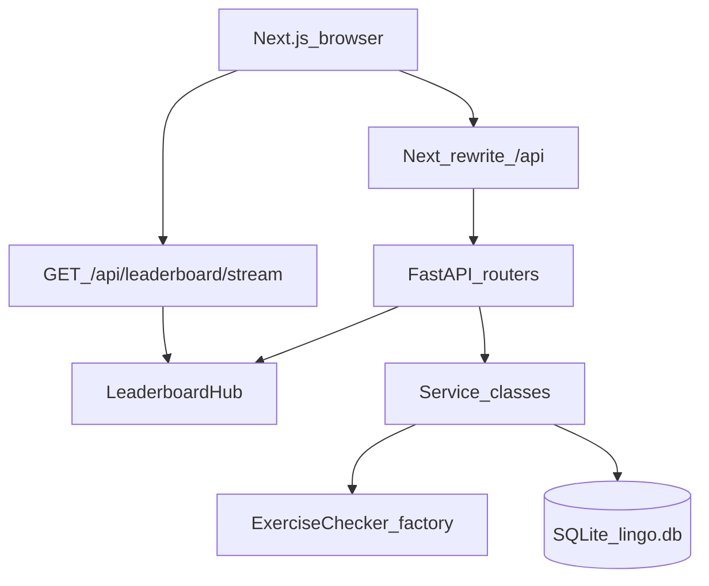
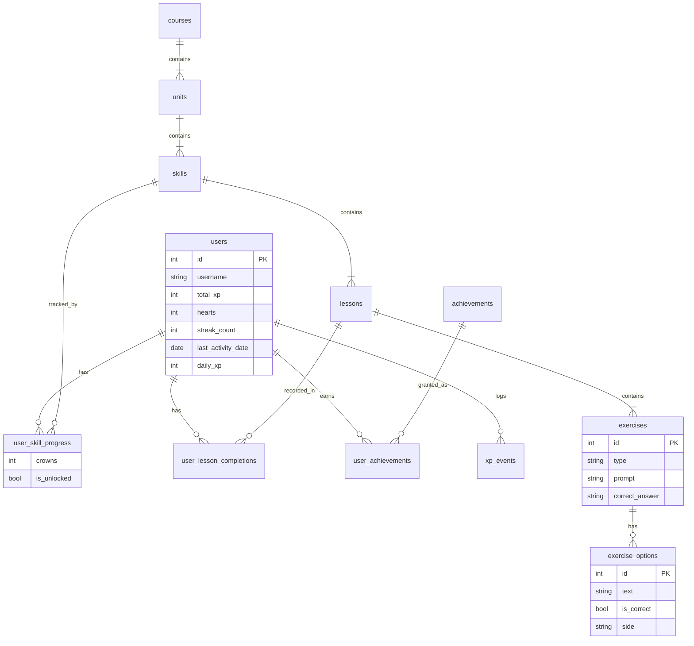
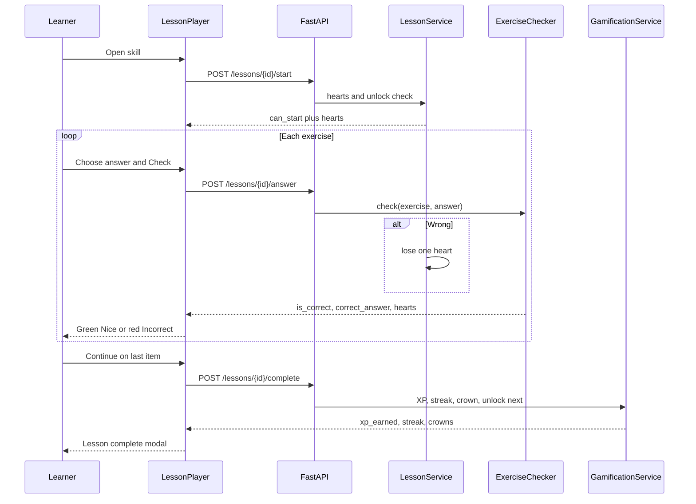
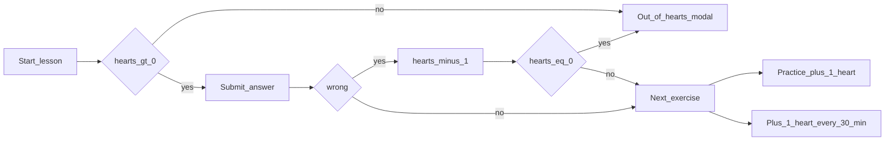

# Fluent

A Duolingo-style Spanish learning web app. Learners follow a skill path, complete mixed-exercise lessons, earn XP, keep a streak, and lose hearts on wrong answers.

The product name is **Fluent**. The UI follows Duolingo's layout, colors, and lesson loop.

You are always signed in as the seeded learner **Alex**.

---

## How to run locally

Use two terminals. SQLite is created at `backend/data/lingo.db` on first boot.

### Backend

```bash
cd backend
python -m venv .venv

# Windows
.venv\Scripts\activate

# macOS / Linux
source .venv/bin/activate

pip install -r requirements.txt
copy .env.example .env   # Windows
# cp .env.example .env   # macOS / Linux
python -m uvicorn app.main:app --reload --port 8000
```

API: `http://127.0.0.1:8000`  
Docs: `http://127.0.0.1:8000/docs`

### Frontend

```bash
cd frontend
copy .env.example .env.local   # Windows
# cp .env.example .env.local   # macOS / Linux
npm install
npm run dev
```

Open `http://localhost:3000`. The browser calls FastAPI at `http://127.0.0.1:8000` (`NEXT_PUBLIC_API_URL`). That keeps leaderboard server-sent events off the Next.js rewrite.

If you already have an old `backend/lingo.db`, the API still uses it. New installs use `backend/data/lingo.db`.

---

## How to run with Docker

You need Docker Desktop running. From the project root:

```bash
docker compose up --build
```

Then open `http://localhost:3000`. Nginx routes `/` to the Next.js app and `/api` to FastAPI.

| Service | Image | On your machine |
| --- | --- | --- |
| App (nginx) | `nginx` + `lingo-frontend` | http://localhost:3000 |
| API docs | `lingo-backend` | http://localhost:8000/docs |
| SQLite | file on disk | `data/lingo.db` |

The database is **not** inside the image. It is the file `data/lingo.db` on your computer (mounted at `/data/lingo.db` in the backend container). Rebuilds keep it.

After you change code:

```bash
docker compose up --build -d
```

That rebuilds `lingo-backend` and `lingo-frontend`, recreates containers, and **leaves `data/lingo.db` alone**. XP, hearts, streaks, and crowns stay.

To reset demo data only (Alex starts over):

```bash
docker compose down
# delete data/lingo.db  (and data/lingo.db-wal, data/lingo.db-shm if present)
docker compose up --build
```

Do **not** delete `data/lingo.db` when you only changed UI or lesson code.

Stop with `Ctrl+C`, then `docker compose down`. That stops containers. It does not delete `data/lingo.db`.

---

## How to test the live leaderboard

The league is real data from the `users` table, sorted by `total_xp`. The Leaderboards page uses **server-sent events** (`GET /api/leaderboard/stream`). The browser keeps one open connection. When a lesson is completed, the backend pushes the new ranking. There is no 4-second refresh.

1. Open [http://localhost:3000/leaderboard](http://localhost:3000/leaderboard).
2. You should see **Live via server-sent events**.
3. Keep that tab open.
4. In a **new tab**, finish a lesson on Learn.
5. Watch Alex’s XP and rank change immediately in the first tab.

A lesson awards **10 XP**, or **15 XP** if you lose no hearts. Legendary awards **20 XP**.

To reset demo data locally, stop the API, delete `backend/data/lingo.db` (and `backend/lingo.db` if that file still exists), and start the API again.

---

## Grading (why answers looked “always correct”)

The server always compared your submitted text to `exercises.correct_answer`. That logic was already strict (wrong MCQ answers return `is_correct: false` and remove a heart).

Two UI issues made it *feel* like everything was correct:

1. **The right choice was always option A / top-left** in the seed. Clicking the first button passed every question.
2. After Check, you could still change options, and wrong feedback was easy to miss.

What changed:

- Choices are **shuffled** every time a lesson is fetched.
- Multiple-choice and fill-in-the-blank are graded with `exercise_options.is_correct`, not “whatever is first”.
- After Check, answers lock.
- A wrong answer shows a red **Incorrect** bar and the real solution. A heart is removed.

Try it: open a lesson, pick a clearly wrong option, press Check. You should see red feedback and hearts go from 5 to 4.

Spanish content was reviewed. Examples: *Hola* = Hello, *Me llamo* = My name is, *¿Cómo estás?* = How are you?, *el pan* = bread, *el gato* = the cat.

---

## Requirements checklist

| Requirement | Status |
| --- | --- |
| Learning path with lock / available / completed + crown rings | Done |
| Top bar: streak, XP goal, hearts, mocked gems | Done |
| Five exercise types | Done |
| Immediate correct / incorrect bar | Done |
| Hearts on wrong answers, out-of-hearts modal | Done |
| XP + skill progress on complete | Done |
| Streak with simulate-next-day | Done |
| Leaderboard from real user XP | Done (live SSE, no polling) |
| Hearts regen (30 min) and practice refill | Done |
| Daily XP goal | Done |
| Progress persisted per user | Done |
| Course content in SQLite, seeded | Done |
| Profile + achievements | Done |
| Duolingo-like UI, modals, path | Done |
| Shop / Super / speech / friends placeholders | Super and speech are Coming Soon on the home rail / Settings. Shop page removed. |
| Dark mode, TTS, legendary, responsive | Done (bonus) |

---

## Architecture

Three backend layers. Routers do HTTP. Services own game rules. Models are tables. Exercise scoring is a small factory of checker classes.



### Folder map

```
backend/app/
  main.py              FastAPI app, CORS, startup seed
  config.py            hearts, XP, default user id, env + SQLite path
  database.py          SQLite engine, WAL, get_db
  models/              SQLAlchemy tables
  schemas/             Pydantic request/response
  routers/             thin HTTP endpoints
  services/            User, Course, Lesson, Gamification
  checkers/            one class per exercise type
  events.py            leaderboard SSE hub
  seed.py              Spanish course + Alex + league users

frontend/
  app/(app)/           Learn, profile, league, settings
  app/lesson/          fullscreen lesson player
  app/practice/        heart refill practice
  app/legendary/       timed challenge
  components/          path, lesson, layout, icons
  lib/api.ts           fetch helpers only

docker-compose.yml       builds lingo-backend + lingo-frontend; SQLite in ./data
backend/Dockerfile      FastAPI image, DATABASE_PATH=/data/lingo.db
frontend/Dockerfile      Next.js standalone image
nginx/default.conf       same-origin /api proxy, SSE unbuffered
data/                    Docker SQLite file (lingo.db is gitignored)
backend/data/            local (non-Docker) SQLite folder
```

---

## Database design

Course content and learner progress are separate. That keeps the Spanish course reusable if you add more users later.



Unlock rule: skill 1 starts unlocked. Completing a skill (at least 1 crown) unlocks the next skill on the path.

---

## Lesson sequence

The browser never decides if an answer is right. Every Check hits the API.



### Heart flow



---

## API overview

All routes are under `/api`. `get_current_user` always loads Alex (`user_id = 1`).

| Method | Path | What it does |
| --- | --- | --- |
| GET | `/health` | Liveness |
| GET | `/users/me` | Stats; also regenerates hearts |
| POST | `/users/me/simulate-day` | Move last activity back one day |
| POST | `/users/me/refill-hearts` | Mock full refill |
| GET | `/course/path` | Units, skills, locks, crowns |
| GET | `/lessons/{id}` | Prompts and shuffled options, no answers |
| POST | `/lessons/{id}/start` | Unlock + hearts gate |
| POST | `/lessons/{id}/answer` | Grade one exercise |
| POST | `/lessons/{id}/complete` | XP, streak, crowns, badges |
| GET | `/practice` | Five review MCQs |
| POST | `/practice/answer` | Grade without losing hearts |
| POST | `/practice/complete` | +1 heart |
| GET | `/leaderboard` | Users ranked by total XP |
| GET | `/leaderboard/stream` | SSE push when XP changes |
| GET | `/profile` | Stats + achievements |
| POST | `/legendary/{skill_id}/complete` | Timed bonus XP |

Lesson fetch never sends `is_correct` on options.

---

## Game rules

- Wrong answer: -1 heart. At 0 hearts the lesson stops.
- Hearts refill 1 every 30 minutes, +1 from Practice, or full refill in Settings.
- Lesson XP = 10. Perfect lesson (0 hearts lost) = +5 bonus.
- Legendary (unlocked skill with at least 1 crown) = 20 XP, 60 second timer.
- Streak: same day keep, yesterday +1, older gap reset to 1.
- Settings → Simulate next day exists so you can demo streak without waiting.

---

## Seeded course

Spanish for English speakers.

- Unit 1: Greetings, Introductions, Phrases
- Unit 2: Food, Animals
- Unit 3: Places

Each skill has one lesson with multiple-choice, translate (word bank), match pairs, fill in the blank, and type-the-answer.

Alex starts with Greetings crowned, 120 XP, a 3-day streak, and a few badges. Bella, Carlos, Dana, and Eli exist so the league is not empty.

---

## Frontend design

- Font: Nunito
- Green `#58CC02`, blue `#1CB0F6`, gold `#FFC800`, heart red `#FF4B4B`
- 3D buttons (bottom shadow)
- Left nav, center path, right rail (quests, league, Super)
- Lesson player is fullscreen: progress bar, speaker, Check, feedback bar
- Dark mode toggle in Settings (`data-theme="dark"`)
- Jump back in + guidebook Start links so a lesson is always one click away
- Leaderboard uses server-sent events (no 4-second refresh)
- Enter checks / continues a lesson; 1-4 pick a multiple-choice option
- Short correct / incorrect tones
- Hearts chip shows time until the next regen

Business rules stay on the server. React components only render and call `lib/api.ts`.

---

## Assumptions

- No signup. The UI is always Alex.
- One language.
- Speech recognition, Super IAP, friends, and a gem shop are placeholders / omitted.
- Audio uses the browser Speech Synthesis API.
- Refreshing mid-lesson restarts the lesson.
- SQLite is a file. Keep it on a disk / Docker volume so progress is not lost.

---

## Deploy

Use the **backend image** and **frontend image** from this repo. Nginx in Compose sits in front so the browser uses one origin (`/api` → backend, `/` → frontend). That is the setup that keeps leaderboard SSE working.

**Rules that keep the database alive**

1. SQLite is `data/lingo.db` on the host, mounted into the backend at `/data/lingo.db`.
2. Images contain code only. Never copy `lingo.db` into a Dockerfile.
3. On startup the API creates missing tables and seeds **only if user `alex` is missing**. Existing progress is not overwritten.
4. Run **one** backend worker (the Dockerfile already does this). Extra workers split SQLite and the live leaderboard.
5. After you change Python/TS, rebuild images. Do not delete `data/lingo.db` unless you want a fresh seed.

### 1. First deploy (your PC or a VPS)

Install Docker Desktop (or Docker Engine + Compose on Linux). From the project root:

```bash
docker compose up --build -d
```

Wait until `backend`, `frontend`, and `proxy` are healthy, then open:

- App: `http://YOUR_SERVER:3000`
- API docs: `http://YOUR_SERVER:8000/docs`

Confirm `data/lingo.db` exists. Play a lesson. `data/lingo.db` should grow / update. Restart:

```bash
docker compose restart
```

Alex’s XP should still be there.

### 2. Deploy code changes later

```bash
git pull
docker compose up --build -d
```

`--build` rebuilds `lingo-backend:latest` and `lingo-frontend:latest`. Containers are replaced. `./data` is bind-mounted, so the database file is the same file as before.

Check:

```bash
docker compose ps
docker compose logs backend --tail 50
```

You should **not** see a full re-seed (that only happens when `alex` is missing). If you accidentally deleted `data/lingo.db`, the seeder runs again and Alex is back at the demo start.

### 3. Build the two images yourself (optional)

```bash
docker build -t lingo-backend:latest ./backend

docker build -t lingo-frontend:latest ./frontend --build-arg NEXT_PUBLIC_API_URL= --build-arg API_PROXY_TARGET=http://backend:8000
```

Leave `NEXT_PUBLIC_API_URL` empty for Compose/nginx (same-origin `/api`). Then `docker compose up -d` uses those image names.

### 4. VPS with HTTPS (Caddy / Cloudflare in front)

Point the reverse proxy at **port 3000** (nginx), not 8000. Keep `NEXT_PUBLIC_API_URL` empty in the frontend image. Same-origin `/api` does not need CORS.

If TLS terminates in front of Docker, nginx already forwards `X-Forwarded-Proto`.

### 5. If you change database tables

`create_all` **adds new tables**. It does **not** alter columns on an old `lingo.db`. For this assignment, if you change a model column, delete `data/lingo.db` once and start again so seed recreates a matching file. Lesson XP changes are code, not schema — those survive.

### Split frontend + API (Vercel + Render) — only if you are not using Compose

**Backend image:** `backend/Dockerfile`, disk mount `/data`, `DATABASE_PATH=/data/lingo.db`, workers = 1, `CORS_ORIGINS=https://your-app.vercel.app`.

**Frontend image / Vercel:** set `NEXT_PUBLIC_API_URL=https://your-api.example.com` **at image build time** (no trailing slash), then rebuild.
